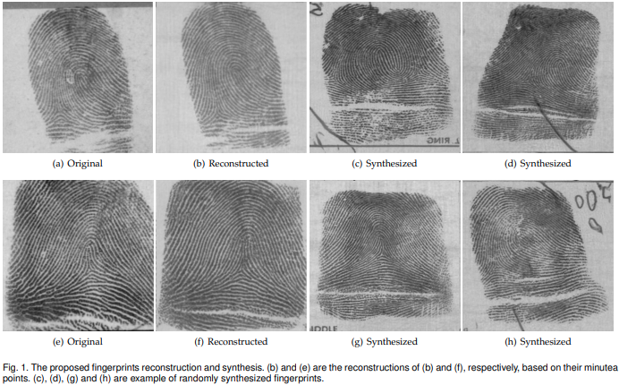
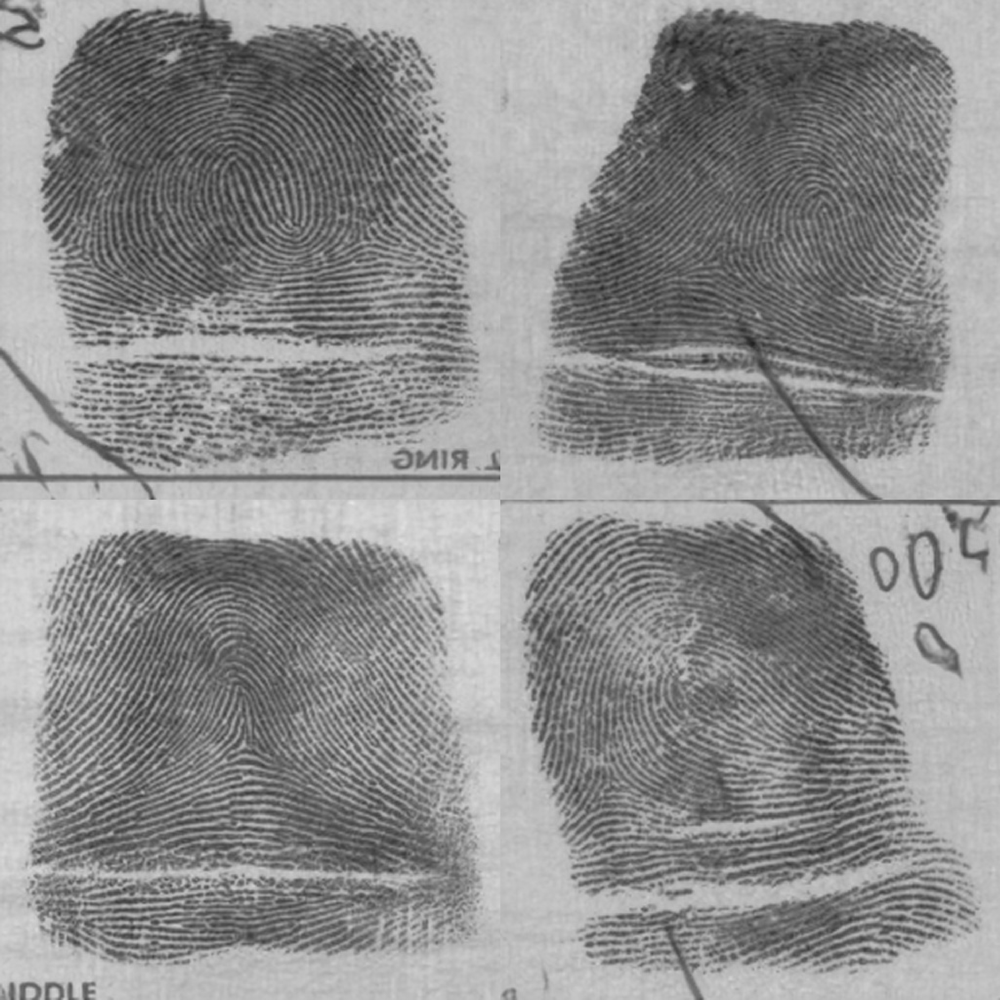
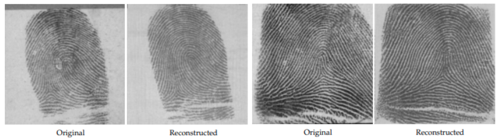
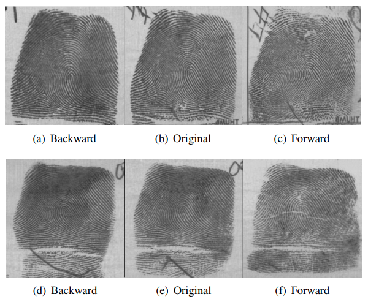

# Synthesis and Reconstruction of Fingerprints using Generative Adversarial Networks
  
> Deep learning-based models have been shown to
improve the accuracy of fingerprint recognition. While these algorithms
show exceptional performance, they require large-scale
fingerprint datasets for training and evaluation. In this work, we
propose a novel fingerprint synthesis and reconstruction framework
based on the StyleGan2 architecture, to address the privacy
issues related to the acquisition of such large-scale datasets. We
also derive a computational approach to modify the attributes
of the generated fingerprint while preserving their identity. This
allows synthesizing multiple different fingerprint images per finger.
In particular, we introduce the SynFing synthetic fingerprints
dataset consisting of 100K image pairs, each pair corresponding
to the same identity. The proposed framework was experimentally
shown to outperform contemporary state-of-the-art approaches
for both fingerprint synthesis and reconstruction. It significantly
improved the realism of the generated fingerprints, both visually
and in terms of their ability to spoof fingerprint-based verification
systems.


<p align="center">

</p>

## Description   
Official Implementation of the paper "[Synthesis and Reconstruction of Fingerprints using Generative Adversarial Networks](https://arxiv.org/abs/2201.06164).
This repository contains both training and inference scripts.

## Recent Updates
**`2022.02.08`**: Initial code release.

## Applications
### Fingerprint Synthesis
Here, we use out framework to generate real-looking fingerprint images using our StyleGAN-based generator trained on NISTSD4 dataset. 
<p align="center">

</p>


### Fingerprint Reconstruction
In this application we want to reconstruct a fingerprint image for it's minutiae information. 
<p align="center">

</p>

### Fingerprint Attribute Editor
Here, we are using out Fingerprint attribute editor, based on SeFa [2] algorithm for editing visual attributes of a generated fingerprint.
<p align="center">

</p>


## Getting Started
### Prerequisites
- Linux
- NVIDIA GPU + CUDA CuDNN (CPU may be possible with some modifications, but is not inherently supported)
- Python 3
- torch == 1.6

### Installation
- Clone this repo:
``` 
git clone https://github.com/rafaelbou/pixel2style2pixel.git
cd pixel2style2pixel
```
- Dependencies:  
We recommend running this repository using [Anaconda](https://docs.anaconda.com/anaconda/install/).  
All dependencies for defining the environment are provided in `environment/fingergen_env.yaml`.


### Pretrained Models
Please download the pre-trained models from the following links.
| Path | Description
| :--- | :----------
|[fingerprint_synthesis](https://drive.google.com/file/d/1BRqgVCa5PUeR0Unkz2ym13XXebrjJSpP/view?usp=sharing)  | Model trained with the NIST SD14 dataset for fingerprint synthesis.
|[fingerprint_reconstruction](https://drive.google.com/file/d/1xfWr1dt9saQT77NOoABauXdI2ANXzS9o/view?usp=sharing)  | Model trained with the NIST SD14 dataset for fingerprint reconstruction from minutiae set.

If you wish to use one of the pretrained models for training or inference, you may do so using the flag `--checkpoint_path`.

## Training
### Preparing your Data
- Currently, we provide support for Synthesis and Reconstruction datasets and experiments.
    - Refer to `configs/paths_config.py` to define the necessary data paths and model paths for training and evaluation. 
    - Refer to `configs/transforms_config.py` for the transforms defined for each dataset/experiment. 
    - Finally, refer to `configs/data_configs.py` for the source/target data paths for the train and test sets
      as well as the transforms.
- If you wish to experiment with your own dataset, you can simply make the necessary adjustments in 
    1. `data_configs.py` to define your data paths.
    2. `transforms_configs.py` to define your own data transforms.

### Training Scripts
The main training scripts can be found in `scripts/train_generator.py` and `scripts/train_mnt_encoder.py` for synthesis an reconstruction tasks, respectively.   
Intermediate training results are saved to `opts.exp_dir`. This includes checkpoints, train outputs, and test outputs.  
Additionally, if you have tensorboard installed, you can visualize tensorboard logs in `opts.exp_dir/logs`.

#### **Synthesis - Fingerprint Generator**
```
python scripts/train_generator.py 
--exp_dir=<OUTPUT FOLDER PATH>
--generator_image_size=256
--batch_size=4
--is_gray
--augment
--image_interval=2500
--save_interval=5000
```

#### **Reconstruction - Minutiae-to-Vec Encoder**
```
python scripts/train_mnt_encoder.py
--exp_dir=<OUTPUT FOLDER PATH>
--dataset_type=nist_sd14_mnt
--stylegan_weights=<PATH TO PRETRAINED STYLEGAN2 MODEL>
--generator_image_size=256
--style_count=14
--label_nc=1
--input_nc=3
--lpips_lambda=0.8
--l2_lambda=1
--fingernet_lambda=1
--workers=6
--batch_size=6
--test_batch_size=6
--test_workers=6
--val_interval=2500
--save_interval=5000
```

##### Additional Notes
- See `options/train_options.py` for all training-specific flags.
- If you wish to resume from a specific checkpoint, you may do so using `--checkpoint_path`.

## Inference
The main inference scripts can be found in `scripts/inference_generator.py` and `scripts/inference_mnt_encoder.py` for synthesis and reconstruction tasks, respectively.

#### Synthesis
```
python scripts/inference_generator.py \
--exp_dir=<OUTPUT FOLDER PATH>
--checkpoint_path=<PATH TO PRETRAINED STYLEGAN2 MODEL>
--is_gray
--n_image=20
```

#### Reconstruction
```
python scripts/inference_mnt_encoder.py \
--exp_dir=<OUTPUT FOLDER PATH>
--checkpoint_path=<PATH TO PRETRAINED SYNFING MODEL (Mnt-To-Vec Encoder + Fingerprint-Generator)>
--data_path=<PATH TO MNT MAPS FOLDER>
--resize_output
```

##### Additional Notes
- See `options/test_options.py` for all test-specific flags.
- During inference, the options used during training are loaded from the saved checkpoint and are then updated using the 
test options passed to the inference script.  For example, there is no need to pass `--dataset_type` or `--label_nc` to the 
 inference script, as they are taken from the loaded `opts`.

### Fingerprint Attribute Editor
The main scripts can be found in `fingerprint_attribute_editor/closed_form_factorization.py` and `fingerprint_attribute_editor/attribute_editor.py` for calculating and applying the latent semantic directions, respectively.

#### Closed form factorization
This script is used to estimate the latent semantic directions in w that modify particular fingerprint attributes while preserving their identity
```
python fingerprint_attribute_editor/closed_form_factorization.py
--exp_dir=<OUTPUT FOLDER PATH>
--checkpoint_path=<PATH TO PRETRAINED STYLEGAN2 MODEL>
```

#### Attribute Editor
This script is used to apply on of the latent semantic directions in order to edit the generated fingerprint attributes.

```
python fingerprint_attribute_editor/attribute_editor.py
--exp_dir=<OUTPUT FOLDER PATH>
--checkpoint_path=<PATH TO PRETRAINED STYLEGAN2 MODEL>
--factor_path=<PATH TO facor.pt FILE (the output of closed_form_factorization.py>
--index=22
--degree=5
--n_sample=1 
--is_gray
--resize_factor=512
--number_of_outputs=5
```

##### Additional Notes
- The output of the closed_form_factorization.py script, factor.pt file, will be saved to exp_dir.
- The attribute_editor.py script will output three different images, backward, original and forward, for each generated fingerprint.
- See `fingerprint_attribute_editor/attribute_editor_options.py` for all attribute_editor flags. 


## Credits
**StyleGAN2 implementation:**  
https://github.com/rosinality/stylegan2-pytorch  
Copyright (c) 2019 Kim Seonghyeon  
License (MIT) https://github.com/rosinality/stylegan2-pytorch/blob/master/LICENSE
  
**pixel2style2pixel implementation:**  
https://github.com/eladrich/pixel2style2pixel 
Copyright (c) 2020 Elad Richardson, Yuval Alaluf  
License (MIT) https://github.com/eladrich/pixel2style2pixel/blob/master/LICENSE


## Citation
If you use this code for your research, please cite our paper <a href="https://arxiv.org/pdf/2201.06164.pdf">Synthesis and Reconstruction of Fingerprints using Generative Adversarial Networks</a>:

```
@article{bouzaglo2022synthesis,
  title={Synthesis and Reconstruction of Fingerprints using Generative Adversarial Networks},
  author={Bouzaglo, Rafael and Keller, Yosi},
  journal={arXiv preprint arXiv:2201.06164},
  year={2022}
}
```
